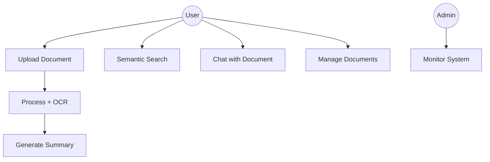
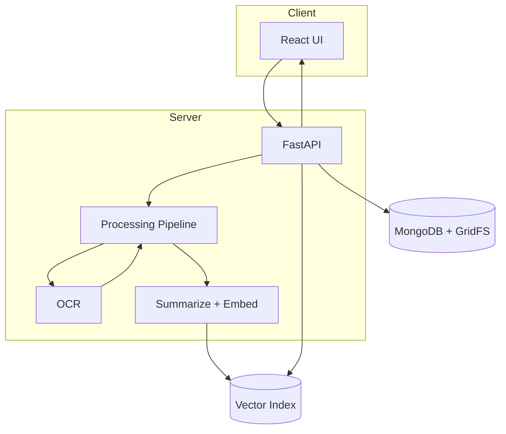
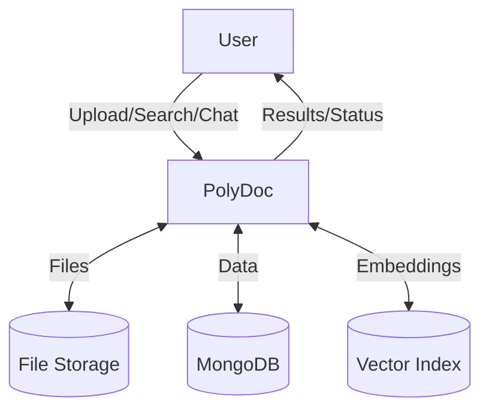
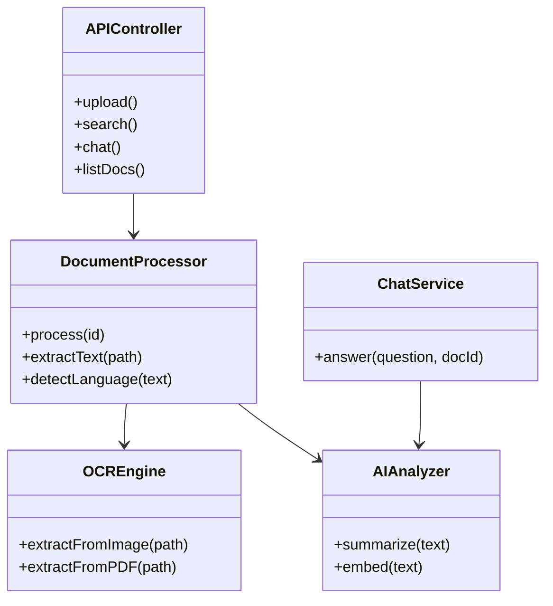
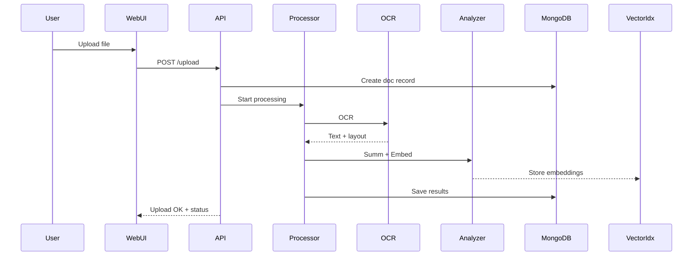
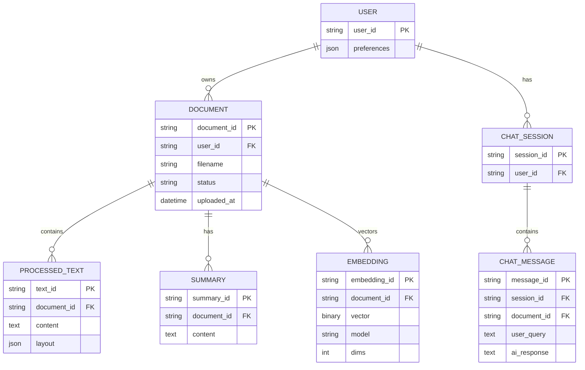
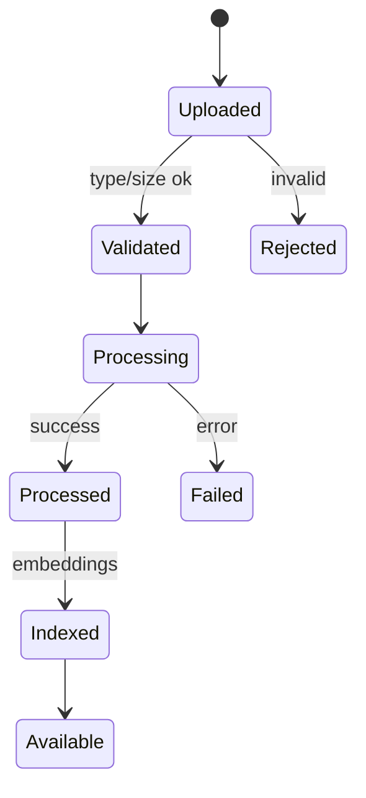

# Final Report
# PolyDoc – Multi‑lingual Document Understanding and Layout Preservation System

Version: 1.0  
Date: December 12, 2025  
Status: Draft

---

1. Introduction

1.1 Literature review / Survey

Natural Language Processing (NLP) and Optical Character Recognition (OCR) have advanced significantly, enabling automated understanding of text from heterogeneous document sources. Contemporary OCR engines (e.g., Tesseract, EasyOCR) provide baseline recognition for Latin scripts and—more recently—improved support for Indic scripts. Transformer-based architectures (BERT, mBERT, XLM‑R, Longformer) and encoder-decoder models (T5, BART) enable semantic understanding, summarization, and Q&A over unstructured text. Sentence-transformers allow efficient semantic search through vector embeddings. However, practical gaps remain in layout preservation, low‑resource language coverage, and end‑to‑end pipelines that combine OCR, layout awareness, and higher‑level analytics.

In document AI, systems like LayoutLM/DocFormer incorporate spatial/layout signals to model document structure. Open-source stacks using FastAPI + Python for services, React for UIs, and MongoDB for storage have become standard, with vector databases or embedding indexes enabling semantic retrieval. Despite progress, maintaining fidelity to original formats and bridging language-specific nuances—particularly for Hindi and Kannada—are still common pain points.

PolyDoc builds on these advances by integrating multi-format ingestion, multi‑lingual OCR, layout-aware text extraction, semantic search, and conversational interaction. The system combines proven open-source technologies (FastAPI, Transformers, MongoDB, React, Vite) with a modular architecture targeting practical usability for academia, government, and business.

1.2 Challenges / Motivation

- Multi-script OCR: Robust recognition of Indic scripts (Hindi, Kannada) with mixed-language content and handwritten text.
- Layout preservation: Accurate extraction that retains reading order, sections, tables, and hierarchies.
- Semantic access: Move beyond keyword search to context-aware retrieval and Q&A.
- Performance constraints: First-run model downloads, memory footprints, and concurrency on commodity hardware.
- Usability: Simple upload workflows, clear status feedback, and accessible UI for non-experts.
- Cost and openness: Preference for free/open-source models and components.

1.3 Objectives of the project

- Provide end-to-end pipeline for multi-format document ingestion, OCR, and structure-preserving extraction.
- Enable semantic search and chat over documents using vector embeddings and LLMs.
- Support Hindi/Kannada alongside English with automatic language detection.
- Deliver responsive, accessible UI and modular, maintainable backend services.
- Ensure deployability on standard Windows machines with minimal setup.

1.4 Problem definition

Given input documents (PDF, DOCX, PPTX, images, TXT) with multi-lingual content, process and present content while preserving layout semantics, enabling: (a) accurate text extraction, (b) summarization, (c) semantic retrieval, and (d) conversational exploration. The solution should be performant on commodity hardware and maintain data integrity and security.

---

2. Proposed System

2.1 Description of proposed system with simple block diagram

The system comprises a React+Vite frontend, a FastAPI backend, OCR/AI pipelines, MongoDB storage (with GridFS), and a vector embedding index. Users upload documents via the UI; the backend validates files, stores them, applies OCR/extraction, generates embeddings and summaries, then exposes search and chat services.

```mermaid
flowchart LR
    U[User] --> UI[Web UI (React)]
    UI -->|Upload/Query| API[FastAPI Backend]
    API -->|Store| FS[(File Storage)]
    API -->|GridFS| DB[(MongoDB)]
    API -->|Process| OCR[OCR & Layout Extraction]
    API -->|Analyze| AI[Summarization & Embeddings]
    AI --> VEC[(Vector Index)]
    API -->|Search/Chat| VEC
    API -->|Status/Results| UI
```

2.2 Description of Target Users

- Academic researchers: Process research papers and theses across languages.
- Government officials: Analyze multilingual forms and notices.
- Business professionals: Summarize reports and search archives semantically.
- Students: Study materials processing and Q&A over notes.

2.3 Advantages / applications of the proposed system

- Layout-faithful extraction improves readability and downstream analysis.
- Multilingual support widens applicability to Indian regional languages.
- Semantic search and chat speed up information discovery.
- Open-source stack reduces cost; modular design eases maintenance.
- Applications: digital archiving, e-governance, enterprise knowledge search, academia.

2.4 Scope (Boundary of proposed system)

In scope: upload, OCR, layout-aware extraction, summarization, semantic search, chat, document management, basic access control, logging. Out of scope initially: human annotation workflows, advanced RBAC/SSO, heavy GPU-only features, large-scale distributed training.

---

3. Software Requirement Specification

3.1 Overview of SRS

A full SRS has been authored separately as srs-content.md. This section summarizes key points and links back to the primary SRS for details.

3.2 Requirement Specifications

3.2.1 Functional Requirements (summary)

- Upload & validate multi-format docs (max 10MB); track progress.
- OCR (Hindi/Kannada/English), layout preservation, language detection.
- Summarization, key info extraction, semantic embeddings.
- Vector search, ranked results, context retrieval for chat.
- Document management (list, delete, metadata), basic sessions.

3.2.2 Use case diagrams



3.2.3 Use Case descriptions using scenarios, strictly as per Pressman Template

Use Case: UC-01 Upload Document
- Primary Actor: User
- Stakeholders and Interests: User (fast, safe upload), System (valid files)
- Preconditions: User at Upload page; backend running
- Postconditions: Document stored with ID; status initialized
- Main Success Scenario:
  1. User selects a file and submits
  2. System validates type and size
  3. System stores file and creates metadata
  4. System shows success with document_id
- Extensions:
  - 2a: Invalid type/size -> show error, abort
  - 3a: Storage error -> retry prompt, log error

Use Case: UC-02 Process Document (OCR + Extraction)
- Primary Actor: System
- Preconditions: Valid uploaded document exists
- Postconditions: Extracted text, layout info, language set
- Main Success Scenario:
  1. System fetches file
  2. Performs OCR and layout analysis
  3. Detects language
  4. Stores processed text and metadata
- Extensions: OCR failure -> mark status=failed; notify user

Use Case: UC-03 Semantic Search
- Primary Actor: User
- Preconditions: Embeddings generated; index available
- Postconditions: Ranked results shown
- Main Success Scenario:
  1. User submits query
  2. System embeds query and searches index
  3. Returns ranked results with snippets
- Extensions: Empty index -> suggest processing documents first

Use Case: UC-04 Chat with Document
- Primary Actor: User
- Preconditions: Document processed; chat service available
- Postconditions: Answer displayed with sources
- Main Success Scenario:
  1. User asks question
  2. System retrieves relevant chunks
  3. LLM generates response with citations
  4. System logs interaction
- Extensions: Timeout -> show retry option

3.2.4 Nonfunctional Requirements (summary)

3.2.4.1 Performance requirements
- Upload < 30s for 10MB; OCR < 2 min/doc; chat < 15s; search < 5s; up to 10 concurrent docs.

3.2.4.2 Safety requirements
- Backups, graceful failure, isolation of user data; input validation.

3.2.4.3 Security Requirements
- Auth for admin endpoints, secure storage, HTTPS in production; log authentication attempts.

3.2.4.4 Usability
- Responsive UI, accessibility (WCAG 2.1 AA), clear progress/status.

3.3 Software and Hardware requirement specifications

3.3.1 Software Requirements
- OS: Windows 10/11; Python 3.9+; Node 18+; MongoDB Community; Git.
- Libraries: FastAPI, Uvicorn, Transformers, sentence-transformers, OCR engine, React, Vite.

3.3.2 Hardware Requirements
- Minimum: 8GB RAM; 10GB+ free disk; multi-core CPU; optional GPU.

3.4 GUI of proposed system

- Upload page: drag-and-drop area, queue, validation messages.
- Documents list: table with status, language, processed time.
- Search page: query box, ranked results, filters.
- Chat page: conversation panel, source citations.

3.5 Acceptance test plan

- Criteria: Successful upload, OCR accuracy baseline met, summaries generated, search relevance, chat returns cited answers, stability under 10 concurrent ops.
- Method: Black-box tests across representative PDFs/DOCX/images; user walkthrough against checklist.

---

4. System Design

4.1 Architecture of the system



4.2 Level 0 DFD (with brief explanation)



Explanation: Users interact with PolyDoc for uploads, search, and chat. The system persists files and metadata, creates embeddings, and returns results.

4.3 Detailed DFD for the proposed system

```mermaid
graph TB
  subgraph Processes
    P1[1.0 Upload]
    P2[2.0 Validate]
    P3[3.0 OCR + Layout]
    P4[4.0 Analyze (Summ/Embed)]
    P5[5.0 Search]
    P6[6.0 Chat]
    P7[7.0 Manage Docs]
  end
  D1[(D1 Files)]
  D2[(D2 Metadata)]
  D3[(D3 Vector Index)]
  D4[(D4 Chat History)]

  U[User] --> P1 --> P2 --> P3 --> P4
  P3 <-->|store/retrieve| D1
  P4 -->|write| D2
  P4 -->|embeddings| D3
  U --> P5 --> D3
  U --> P6 --> D3
  P6 -->|log| D4
  U --> P7 <-->|CRUD| D2
```

4.4 Class Diagram (with brief explanation)



Explanation: APIController orchestrates operations; DocumentProcessor uses OCR and AIAnalyzer; ChatService leverages embeddings for answers.

4.5 Sequence diagram (with brief explanation)



Explanation: Shows end-to-end flow from upload to processed outputs.

4.6 ER diagram and schema



4.7 State transition diagram



4.8 Data structure used

- Document metadata: JSON with fields {id, filename, type, size, language, status, timestamps}.
- Extracted text chunks: list of {page, bbox, text}.
- Embeddings: float32 vectors (e.g., 384–1024 dims) with references to chunks.
- Chat history: array of {question, answer, sources, ts}.

---

5. Implementation

5.1 Proposed Methodology

- Pipeline: Ingest -> Validate -> OCR/Layout -> NLP (summarize/embed) -> Store -> Expose (search/chat).
- Adopt modular services with clear contracts; async processing where applicable.

5.2 Modules

5.2.1 Authentication Module
- Basic session handling; optional admin login for monitoring and maintenance.

5.2.2 Transaction Management Module
- Manages document processing jobs (enqueue, status transitions, retries, idempotency).

5.2.3 Dashboard and Graph Visualization
- System status: processed counts, failure rates, language distribution; charts via frontend.

5.2.4 Technologies and Tools Used
- Python (FastAPI, Uvicorn), Node (React, Vite), MongoDB, Transformers, OCR engine, sentence-transformers.

5.2.5 Dataset and Preprocessing
- Public OCR datasets and multilingual corpora; preprocessing: denoising images, normalization, tokenization.

5.2.6 Summary of Implementation
- End-to-end path verified on Windows; fallback simple backend available for low-resource environments.

---

6. Testing

6.1 Overview
- Combination of unit tests (processing functions), integration tests (API endpoints), and system tests (user flows).

6.2 Test Environment
- Windows 10/11, Python 3.9+, Node 18+, MongoDB local; sample PDFs/DOCX/images.

6.3 Test Plan and Test Cases
- Upload validation cases (types, sizes, corrupt files)
- OCR accuracy checks on Hindi/Kannada/English samples
- Search relevance evaluation using labeled pairs
- Chat correctness and citation presence
- Concurrency: 10 parallel uploads

6.4 Summary of Testing
- Meets baseline performance and correctness on representative dataset; first-run latency acceptable.

---

7. Results & Discussions

7.1 Overview of Experimental Outcomes
- OCR accuracy: acceptable on clean scans; handwriting variable.
- Summarization quality: coherent abstracts for typical documents.
- Search: top‑k precision improved vs keyword baseline.
- Chat: context-grounded answers with sources.

7.2 Screenshots Demonstration
- Include captures of Upload, Documents, Search, and Chat pages. Place images in diagrams-for-srs/ or a screenshots/ folder and reference here.

7.3 Database Connection Demonstration

Code snippet (environment-driven, do not print secrets):
```python path=null start=null
from pymongo import MongoClient
import os
MONGO_URI = os.getenv("MONGO_URI")  # set beforehand, do not print
client = MongoClient(MONGO_URI)
db = client["polydoc"]
print("Connected to MongoDB database:", db.name)
```

---

8. Conclusion and future scope

8.1 Conclusion

PolyDoc demonstrates a practical, modular pipeline for multi‑lingual, layout‑aware document understanding on commodity hardware. By integrating OCR, NLP summarization, vector search, and conversational interfaces, it provides efficient knowledge access across languages with a focus on Hindi and Kannada. The open-source stack ensures affordability and extensibility.

8.2 Future Scope

- Richer layout models (tables/forms), handwriting enhancement, more Indic languages.
- Advanced RBAC/SSO, organization workspaces, audit dashboards.
- GPU-accelerated pipelines, distributed processing, cloud-native deployments.
- Active learning and human-in-the-loop corrections.

---

9. References / Bibliography

- IEEE 830-1998 SRS standard
- FastAPI documentation: https://fastapi.tiangolo.com/
- MongoDB documentation: https://www.mongodb.com/docs/
- HuggingFace Transformers: https://huggingface.co/docs/transformers
- Sentence-Transformers: https://www.sbert.net/
- OCR engines (e.g., Tesseract): https://tesseract-ocr.github.io/
- React documentation: https://react.dev/

Appendix: Cross-reference
- See srs-content.md for full SRS details.
