# Software Requirements Specification (SRS)
# PolyDoc - Multi-lingual Document Understanding and Layout Preservation System

**Version:** 1.0  
**Date:** December 12, 2025  
**Document Status:** Draft  

---

## Abstract

This Software Requirements Specification (SRS) document presents the comprehensive requirements analysis for **PolyDoc**, an innovative multi-lingual document understanding and layout preservation system designed to address the growing challenges in intelligent document processing across diverse linguistic contexts. PolyDoc represents a significant advancement in the field of Natural Language Processing (NLP) and Optical Character Recognition (OCR) technologies, specifically engineered to handle underrepresented languages such as Hindi and Kannada alongside English, while maintaining the structural integrity and formatting of original documents during the extraction and analysis process.

The system leverages cutting-edge artificial intelligence models, including HuggingFace Transformers and state-of-the-art vector-based semantic search technologies, to provide a comprehensive suite of document processing capabilities. These include automated text extraction from multiple document formats (PDF, DOCX, PPTX, images), intelligent document summarization, real-time conversational interfaces for document interaction, and advanced search functionalities that understand semantic context rather than relying solely on keyword matching. The architecture follows modern microservices principles, utilizing FastAPI for robust backend services, React for responsive frontend interfaces, and MongoDB with GridFS for scalable document storage and management.

What sets PolyDoc apart in the contemporary landscape of document processing solutions is its specific focus on preserving document layout while processing multi-lingual content, particularly addressing the technical challenges associated with Indian regional languages that often lack comprehensive digital processing support. The system is designed with accessibility and usability in mind, catering to diverse user groups including academic researchers, business professionals, students, and government officials who require efficient processing of documents in multiple languages. By implementing free and open-source AI models, PolyDoc ensures cost-effective deployment while maintaining high performance standards, with processing capabilities that can handle concurrent document operations and provide real-time feedback through WebSocket communications. This SRS document establishes the foundation for a system that not only meets current document processing needs but also provides a scalable architecture for future enhancements in the rapidly evolving field of document intelligence and multi-lingual NLP applications.

---

## 1. Introduction

### 1.1 Purpose

The purpose of this Software Requirements Specification (SRS) is to define the functional and non-functional requirements for **PolyDoc**, a multi-lingual document understanding and layout preservation system. This system is being developed to address the growing need for intelligent document processing that can handle multiple languages (particularly Indian languages like Hindi and Kannada), extract meaningful information from various document formats, and provide AI-powered analysis capabilities.

The primary stakeholders for this document include:
- Development team members
- Project managers
- Quality assurance engineers
- End users (researchers, students, professionals)
- System administrators

### 1.2 Scope

**PolyDoc** is a comprehensive document processing system that provides the following capabilities:

**What the system will do:**
- Process multi-format documents (PDF, DOCX, PPTX, TXT, Images)
- Extract text using advanced OCR technology with multi-language support
- Preserve original document layouts during processing
- Provide AI-powered document summarization
- Enable real-time chat interface with documents
- Implement vector-based semantic search
- Support Hindi, Kannada, and English language processing
- Offer document management capabilities (upload, view, delete)

**System Benefits:**
- Reduces manual document processing time by 80%
- Supports underrepresented languages (Hindi, Kannada)
- Preserves document formatting and layout integrity
- Provides intelligent document insights through AI
- Enables efficient document search and retrieval
- Offers free and open-source AI model integration

**Goals:**
- Create an accessible multi-lingual document processing platform
- Demonstrate advanced NLP capabilities for Indian languages
- Provide a user-friendly web interface for document interaction
- Establish a scalable architecture for future enhancements

### 1.3 Definitions, Acronyms, Abbreviations

| Term | Definition |
|------|------------|
| **API** | Application Programming Interface |
| **AI** | Artificial Intelligence |
| **DFD** | Data Flow Diagram |
| **ERD** | Entity-Relationship Diagram |
| **FastAPI** | Modern Python web framework for building APIs |
| **GenAI** | Generative Artificial Intelligence |
| **GPU** | Graphics Processing Unit |
| **ML** | Machine Learning |
| **MongoDB** | NoSQL document database |
| **NLP** | Natural Language Processing |
| **OCR** | Optical Character Recognition |
| **PDF** | Portable Document Format |
| **PolyDoc** | Multi-lingual Document Understanding System |
| **REST** | Representational State Transfer |
| **SRS** | Software Requirements Specification |
| **UI** | User Interface |
| **UML** | Unified Modeling Language |
| **Vector DB** | Vector Database for semantic search |

### 1.4 References

1. **IEEE Standard 830-1998** - IEEE Recommended Practice for Software Requirements Specifications
2. **FastAPI Documentation** - https://fastapi.tiangolo.com/
3. **MongoDB Documentation** - https://docs.mongodb.com/
4. **Transformers Library** - Hugging Face Transformers Documentation
5. **OCR Research Papers** - Multi-lingual OCR techniques and implementations
6. **React Documentation** - https://reactjs.org/docs/
7. **Vite Build Tool** - https://vitejs.dev/guide/
8. **Python 3.9+ Documentation** - https://docs.python.org/3/

### 1.5 Overview

This SRS document is organized into five main sections:

- **Section 1 (Introduction)** provides the purpose, scope, definitions, and overview of the document
- **Section 2 (Overall Description)** describes the product perspective, functions, user characteristics, constraints, and dependencies
- **Section 3 (Specific Requirements)** details functional and non-functional requirements with interface specifications
- **Section 4 (System Models)** presents UML diagrams including use cases, data flow, and entity-relationship diagrams
- **Section 5 (Other Requirements)** covers safety, legal compliance, backup, and audit requirements

---

## 2. Overall Description

### 2.1 Product Perspective

**PolyDoc** is designed as a standalone web-based application with the following system relationships:

**Relation to Existing Systems:**
- **Independent System**: PolyDoc operates as a self-contained document processing platform
- **Web Browser Integration**: Accessible through standard web browsers without additional plugins
- **File System Integration**: Interfaces with the host operating system for document upload/download
- **Database Integration**: Utilizes MongoDB for document storage and metadata management

**System Dependencies:**
- **Frontend**: React-based web interface built with Vite
- **Backend**: Python FastAPI framework for REST API services
- **Database**: MongoDB for document storage and user data
- **AI Models**: HuggingFace Transformers for NLP tasks
- **OCR Engine**: Multi-language text extraction capabilities
- **Vector Database**: For semantic search and document similarity

**System Boundaries:**
- Input: Various document formats through web interface
- Output: Processed text, summaries, chat responses, search results
- External interfaces with file systems and web browsers
- Internal processing using AI/ML models

### 2.2 Product Functions

**Major System Functions:**

**F1. Document Upload and Processing**
- Support for PDF, DOCX, PPTX, TXT, and image formats
- Multi-language OCR with Hindi and Kannada support
- Layout preservation during text extraction
- Automatic language detection

**F2. AI-Powered Document Analysis**
- Intelligent document summarization
- Key information extraction
- Content categorization
- Semantic understanding

**F3. Interactive Document Chat**
- Real-time question-answering interface
- Context-aware responses based on document content
- Multi-turn conversation capability
- Language-specific response generation

**F4. Vector-Based Search**
- Semantic document search
- Content similarity matching
- Advanced query processing
- Multilingual search capabilities

**F5. Document Management**
- Secure document storage
- File organization and categorization
- Document metadata management
- Version control and history tracking

**F6. User Interface**
- Responsive web interface
- Intuitive document upload workflow
- Real-time processing status updates
- Multi-language UI support

### 2.3 User Characteristics

**Primary User Types:**

**U1. Academic Researchers**
- **Skills**: Intermediate to advanced computer literacy
- **Demographics**: Graduate students, professors, research scholars
- **Usage Pattern**: Processing research papers, theses, academic documents
- **Language Needs**: Multi-lingual document analysis (English, Hindi, Kannada)

**U2. Business Professionals**
- **Skills**: Basic to intermediate computer literacy
- **Demographics**: Corporate employees, consultants, analysts
- **Usage Pattern**: Processing business documents, reports, presentations
- **Language Needs**: Primarily English with occasional regional language support

**U3. Students**
- **Skills**: Basic to intermediate computer literacy
- **Demographics**: Undergraduate and graduate students
- **Usage Pattern**: Study materials, assignment processing, research support
- **Language Needs**: Multi-lingual educational content processing

**U4. Government Officials**
- **Skills**: Basic computer literacy
- **Demographics**: Public sector employees, administrators
- **Usage Pattern**: Official document processing, multilingual form analysis
- **Language Needs**: Hindi, Kannada, and English document processing

### 2.4 Constraints

**Technical Constraints:**

**C1. Performance Constraints**
- Minimum 8GB RAM required for AI model execution
- 10GB+ free disk space for model caching
- GPU acceleration preferred but not mandatory
- Maximum file size limit of 10MB per document

**C2. Platform Constraints**
- Web-based application requiring modern browser support
- Python 3.9+ runtime environment
- Node.js 18+ for frontend build process
- Windows 10/11 compatibility (primary target)

**C3. Resource Constraints**
- AI model loading time of 2-5 minutes on first startup
- Memory usage up to 4GB during heavy processing
- Network bandwidth for initial model downloads (2-3GB)

**Budget Constraints:**
- Development using free and open-source technologies
- No licensing fees for core AI models
- Cloud deployment costs (if applicable)
- Minimal hardware requirements for deployment

**Regulatory Constraints:**
- Data privacy compliance (document content security)
- Open-source license compatibility
- No commercial restrictions on AI model usage

### 2.5 Assumptions and Dependencies

**Assumptions:**

**A1. User Environment**
- Users have access to modern web browsers (Chrome, Firefox, Safari, Edge)
- Stable internet connection for initial setup and model downloads
- Basic computer literacy for file upload and navigation

**A2. Technical Environment**
- Host system meets minimum hardware requirements
- Python and Node.js ecosystems remain stable
- MongoDB database availability and reliability

**A3. Business Environment**
- Continued availability of open-source AI models
- User acceptance of processing time for AI operations
- Growing demand for multi-lingual document processing

**Dependencies:**

**D1. External Libraries and Frameworks**
- HuggingFace Transformers library for AI models
- FastAPI framework for backend services
- React and Vite for frontend development
- MongoDB database system

**D2. AI Model Dependencies**
- Pre-trained language models for Hindi and Kannada
- OCR model availability and accuracy
- Sentence transformer models for vector embeddings
- Summarization model performance

**D3. System Dependencies**
- Operating system file handling capabilities
- Web server deployment environment
- Database connectivity and performance
- Network access for external model downloads

---

## 3. Specific Requirements

### 3.1 Functional Requirements

**FR1: Document Upload and Validation**
- **FR1.1**: The system SHALL accept document uploads in PDF, DOCX, PPTX, TXT, and common image formats (PNG, JPG, TIFF)
- **FR1.2**: The system SHALL validate file size limits (maximum 10MB per document)
- **FR1.3**: The system SHALL verify file format integrity before processing
- **FR1.4**: The system SHALL provide real-time upload progress indicators
- **FR1.5**: The system SHALL generate unique identifiers for each uploaded document

**FR2: Multi-language OCR Processing**
- **FR2.1**: The system SHALL extract text from image-based documents using OCR
- **FR2.2**: The system SHALL support Hindi, Kannada, and English text recognition
- **FR2.3**: The system SHALL preserve original document layout during text extraction
- **FR2.4**: The system SHALL automatically detect document language
- **FR2.5**: The system SHALL maintain text formatting and structure information

**FR3: AI-Powered Document Analysis**
- **FR3.1**: The system SHALL generate intelligent summaries of processed documents
- **FR3.2**: The system SHALL extract key information and topics from document content
- **FR3.3**: The system SHALL provide content categorization based on document type
- **FR3.4**: The system SHALL support multi-language summarization capabilities
- **FR3.5**: The system SHALL maintain summary quality metrics and confidence scores

**FR4: Interactive Chat Interface**
- **FR4.1**: The system SHALL provide a chat interface for document-based question answering
- **FR4.2**: The system SHALL maintain conversation context across multiple queries
- **FR4.3**: The system SHALL generate responses based on document content
- **FR4.4**: The system SHALL support multi-language query processing
- **FR4.5**: The system SHALL provide source attribution for chat responses

**FR5: Vector-based Search**
- **FR5.1**: The system SHALL implement semantic search using vector embeddings
- **FR5.2**: The system SHALL support similarity-based document matching
- **FR5.3**: The system SHALL provide ranked search results with relevance scores
- **FR5.4**: The system SHALL support multi-language search queries
- **FR5.5**: The system SHALL maintain search index optimization and updates

**FR6: Document Management**
- **FR6.1**: The system SHALL store processed documents with metadata
- **FR6.2**: The system SHALL provide document listing with filtering capabilities
- **FR6.3**: The system SHALL support document deletion and archival
- **FR6.4**: The system SHALL maintain document access history and statistics
- **FR6.5**: The system SHALL provide document export capabilities

**FR7: User Session Management**
- **FR7.1**: The system SHALL maintain user session state across browser refreshes
- **FR7.2**: The system SHALL provide session timeout management
- **FR7.3**: The system SHALL support concurrent user sessions
- **FR7.4**: The system SHALL maintain user preferences and settings
- **FR7.5**: The system SHALL provide session activity logging

**FR8: System Configuration**
- **FR8.1**: The system SHALL provide configurable processing parameters
- **FR8.2**: The system SHALL support AI model switching and updates
- **FR8.3**: The system SHALL provide system health monitoring capabilities
- **FR8.4**: The system SHALL support backup and restore operations
- **FR8.5**: The system SHALL provide system performance metrics

### 3.2 Non-Functional Requirements

**NFR1: Performance Requirements**
- **NFR1.1**: Document upload response time SHALL be less than 30 seconds for files up to 10MB
- **NFR1.2**: OCR processing time SHALL not exceed 2 minutes per document
- **NFR1.3**: AI model loading time SHALL be less than 5 minutes on system startup
- **NFR1.4**: Chat response time SHALL be less than 15 seconds for typical queries
- **NFR1.5**: Search query response time SHALL be less than 5 seconds
- **NFR1.6**: System SHALL support concurrent processing of up to 10 documents

**NFR2: Reliability Requirements**
- **NFR2.1**: System uptime SHALL be 99% during operational hours
- **NFR2.2**: Document processing success rate SHALL be 95% or higher
- **NFR2.3**: System SHALL gracefully handle processing failures with error recovery
- **NFR2.4**: Data integrity SHALL be maintained across system restarts
- **NFR2.5**: System SHALL provide automatic backup mechanisms
- **NFR2.6**: Critical errors SHALL be logged with appropriate detail for debugging

**NFR3: Usability Requirements**
- **NFR3.1**: User interface SHALL be intuitive requiring minimal training
- **NFR3.2**: System SHALL provide clear error messages and user guidance
- **NFR3.3**: Interface SHALL be responsive across desktop and tablet devices
- **NFR3.4**: System SHALL support accessibility standards (WCAG 2.1 Level AA)
- **NFR3.5**: Processing status SHALL be clearly communicated to users
- **NFR3.6**: Help documentation SHALL be integrated within the application

**NFR4: Security Requirements**
- **NFR4.1**: Uploaded documents SHALL be stored securely with access controls
- **NFR4.2**: System SHALL prevent unauthorized access to user documents
- **NFR4.3**: Data transmission SHALL use secure communication protocols (HTTPS)
- **NFR4.4**: User sessions SHALL implement proper authentication and authorization
- **NFR4.5**: Sensitive data SHALL be encrypted at rest and in transit
- **NFR4.6**: System SHALL implement input validation to prevent malicious uploads

**NFR5: Scalability Requirements**
- **NFR5.1**: System architecture SHALL support horizontal scaling
- **NFR5.2**: Database design SHALL accommodate growing document volumes
- **NFR5.3**: AI model management SHALL support model updates without system downtime
- **NFR5.4**: System SHALL handle increased user load through load balancing
- **NFR5.5**: Storage capacity SHALL be expandable without data migration
- **NFR5.6**: Processing queue SHALL manage multiple concurrent document requests

**NFR6: Compatibility Requirements**
- **NFR6.1**: System SHALL be compatible with major web browsers (Chrome, Firefox, Safari, Edge)
- **NFR6.2**: Backend SHALL run on Windows, Linux, and macOS environments
- **NFR6.3**: System SHALL maintain backward compatibility with older document formats
- **NFR6.4**: API SHALL follow REST principles for third-party integration
- **NFR6.5**: System SHALL support standard document encoding formats
- **NFR6.6**: Database schema SHALL be version-controlled for future updates

### 3.3 External Interface Requirements

#### 3.3.1 User Interfaces (UI)

**UI1: Main Dashboard Interface**
- **UI1.1**: Clean, modern web interface with responsive design
- **UI1.2**: Navigation menu with clear sections: Upload, Documents, Chat, Search
- **UI1.3**: Real-time system status indicators and processing queues
- **UI1.4**: Multi-language interface support (English, Hindi, Kannada)

**UI2: Document Upload Interface**
- **UI2.1**: Drag-and-drop file upload area with progress indicators
- **UI2.2**: File format validation with clear error messaging
- **UI2.3**: Upload queue management with batch processing capabilities
- **UI2.4**: Preview functionality for supported document types

**UI3: Document Processing Interface**
- **UI3.1**: Real-time processing status with detailed progress information
- **UI3.2**: Processing results display with extracted text preview
- **UI3.3**: Document metadata display (language, size, processing time)
- **UI3.4**: Options for reprocessing or downloading results

**UI4: Chat Interface**
- **UI4.1**: Conversational chat interface with message history
- **UI4.2**: Document context selector for targeted queries
- **UI4.3**: Response formatting with source attribution
- **UI4.4**: Multi-language input and response support

#### 3.3.2 Hardware Interfaces

**HW1: Server Hardware Interface**
- **HW1.1**: Minimum 8GB RAM for AI model execution
- **HW1.2**: 10GB+ storage for model caching and document storage
- **HW1.3**: Multi-core CPU support for concurrent processing
- **HW1.4**: Optional GPU acceleration for enhanced AI performance

**HW2: Client Hardware Interface**
- **HW2.1**: Standard web browser with JavaScript support
- **HW2.2**: Minimum 2GB RAM for smooth browser operation
- **HW2.3**: Stable internet connection for file uploads and API communication
- **HW2.4**: Display resolution support from mobile to desktop sizes

#### 3.3.3 Software Interfaces

**SW1: Database Interface (MongoDB)**
- **SW1.1**: Document storage with GridFS for large file handling
- **SW1.2**: Metadata indexing for efficient search and retrieval
- **SW1.3**: User session and preference storage
- **SW1.4**: System configuration and settings management

**SW2: AI Model Interface**
- **SW2.1**: HuggingFace Transformers library integration
- **SW2.2**: Model loading and caching mechanisms
- **SW2.3**: GPU/CPU computation backend switching
- **SW2.4**: Model versioning and update management

**SW3: OCR Engine Interface**
- **SW3.1**: Multi-language OCR service integration
- **SW3.2**: Image preprocessing and enhancement
- **SW3.3**: Text extraction with layout preservation
- **SW3.4**: Confidence scoring and quality metrics

**SW4: File System Interface**
- **SW4.1**: Temporary file storage for processing pipeline
- **SW4.2**: Secure document archival and retrieval
- **SW4.3**: Log file management and rotation
- **SW4.4**: Configuration file reading and validation

#### 3.3.4 Communication Interfaces

**COM1: REST API Interface**
- **COM1.1**: RESTful API endpoints following OpenAPI 3.0 specification
- **COM1.2**: JSON-based request/response format
- **COM1.3**: HTTP status codes for proper error handling
- **COM1.4**: API versioning for backward compatibility

**COM2: WebSocket Interface**
- **COM2.1**: Real-time status updates during document processing
- **COM2.2**: Live chat functionality with immediate response delivery
- **COM2.3**: Processing progress notifications
- **COM2.4**: System health and status broadcasting

**COM3: File Transfer Interface**
- **COM3.1**: Secure file upload with multipart/form-data encoding
- **COM3.2**: File download with proper MIME type handling
- **COM3.3**: Resume capability for large file transfers
- **COM3.4**: Upload progress tracking and cancellation support

---

## 4. System Models

### 4.1 Use Case Diagrams

```mermaid
graph TB
    subgraph "PolyDoc System"
        subgraph "Document Processing"
            UC1[Upload Document]
            UC2[Process Document]
            UC3[Extract Text]
            UC4[Detect Language]
        end
        
        subgraph "AI Services"
            UC5[Generate Summary]
            UC6[Chat with Document]
            UC7[Search Documents]
            UC8[Analyze Content]
        end
        
        subgraph "Document Management"
            UC9[View Documents]
            UC10[Delete Document]
            UC11[Download Results]
            UC12[Manage Metadata]
        end
        
        subgraph "System Administration"
            UC13[Monitor System]
            UC14[Manage Models]
            UC15[View Logs]
            UC16[Backup Data]
        end
    end
    
    subgraph "Actors"
        User[👤 End User]
        Admin[👨‍💼 System Admin]
        System[🖥️ AI System]
    end
    
    User --> UC1
    User --> UC2
    User --> UC5
    User --> UC6
    User --> UC7
    User --> UC9
    User --> UC10
    User --> UC11
    
    Admin --> UC13
    Admin --> UC14
    Admin --> UC15
    Admin --> UC16
    
    System --> UC3
    System --> UC4
    System --> UC8
    System --> UC12
    
    UC1 --> UC2
    UC2 --> UC3
    UC2 --> UC4
    UC3 --> UC5
    UC6 --> UC7
```

### 4.2 Data Flow Diagrams (DFD)

#### 4.2.1 Level 0 DFD (Context Diagram)

```mermaid
graph TB
    subgraph "External Entities"
        User[👤 User]
        Admin[👨‍💼 Admin]
        FileSystem[📁 File System]
        AIModels[🧠 AI Models]
    end
    
    subgraph "PolyDoc System"
        System[🖥️ PolyDoc<br/>Document Processing<br/>System]
    end
    
    User -->|Document Upload| System
    User -->|Search Queries| System
    User -->|Chat Messages| System
    System -->|Processed Results| User
    System -->|Search Results| User
    System -->|Chat Responses| User
    
    Admin -->|System Config| System
    System -->|System Status| Admin
    
    System <-->|Store/Retrieve Files| FileSystem
    System <-->|Model Inference| AIModels
```

#### 4.2.2 Level 1 DFD (System Decomposition)

```mermaid
graph TB
    subgraph "Level 1 Data Flow Diagram"
        subgraph "Input Processes"
            P1[1.0<br/>Document<br/>Upload]
            P2[2.0<br/>File<br/>Validation]
        end
        
        subgraph "Core Processing"
            P3[3.0<br/>OCR<br/>Processing]
            P4[4.0<br/>Language<br/>Detection]
            P5[5.0<br/>AI<br/>Analysis]
        end
        
        subgraph "Services"
            P6[6.0<br/>Chat<br/>Service]
            P7[7.0<br/>Search<br/>Service]
            P8[8.0<br/>Document<br/>Management]
        end
        
        subgraph "Data Stores"
            D1[(D1: Documents)]
            D2[(D2: Metadata)]
            D3[(D3: Vector Index)]
            D4[(D4: Chat History)]
        end
        
        subgraph "External"
            User[👤 User]
            FileStore[📁 File Storage]
            AIEngine[🧠 AI Engine]
        end
    end
    
    User -->|Upload Request| P1
    P1 -->|File Data| P2
    P2 -->|Valid File| P3
    P3 -->|Extracted Text| P4
    P4 -->|Processed Content| P5
    P5 -->|Analysis Results| P8
    
    P3 <-->|Store/Retrieve| FileStore
    P5 <-->|AI Inference| AIEngine
    
    P6 -->|Query| D1
    P6 -->|Context| D3
    P7 -->|Search| D3
    P8 <-->|CRUD Operations| D1
    P8 <-->|Metadata| D2
    
    P5 -->|Embeddings| D3
    P6 <-->|History| D4
    
    User <-->|Chat| P6
    User <-->|Search| P7
    User <-->|Manage| P8
```

### 4.3 Entity-Relationship Diagrams (ERD)

### 4.4 Sequence Diagrams

#### 4.4.1 Document Upload and Processing Sequence

#### 4.4.2 Chat with Document Sequence

### 4.5 Class Diagram

---

## 5. Other Requirements

### 5.1 Safety Requirements

**SR1: Data Safety**
- **SR1.1**: The system SHALL implement automatic data backup mechanisms to prevent document loss
- **SR1.2**: The system SHALL provide data validation to ensure document integrity during processing
- **SR1.3**: The system SHALL implement graceful error handling to prevent system crashes during document processing
- **SR1.4**: The system SHALL provide rollback mechanisms for failed processing operations
- **SR1.5**: The system SHALL isolate user documents to prevent cross-user data contamination

**SR2: System Safety**
- **SR2.1**: The system SHALL implement resource monitoring to prevent system overload
- **SR2.2**: The system SHALL provide circuit breakers for external service dependencies
- **SR2.3**: The system SHALL implement proper exception handling for AI model failures
- **SR2.4**: The system SHALL provide system health checks and automatic recovery mechanisms
- **SR2.5**: The system SHALL implement safe shutdown procedures for maintenance operations

**SR3: User Safety**
- **SR3.1**: The system SHALL validate all user inputs to prevent malicious content processing
- **SR3.2**: The system SHALL implement rate limiting to prevent system abuse
- **SR3.3**: The system SHALL provide clear warnings for potentially sensitive document content
- **SR3.4**: The system SHALL implement secure file handling to prevent malware execution
- **SR3.5**: The system SHALL provide user data anonymization options

### 5.2 Legal/Regulatory Compliance

**LR1: Data Protection Compliance**
- **LR1.1**: The system SHALL comply with applicable data protection regulations (GDPR, CCPA)
- **LR1.2**: The system SHALL provide user consent mechanisms for data processing
- **LR1.3**: The system SHALL implement data retention policies with automatic deletion
- **LR1.4**: The system SHALL provide user rights implementation (access, rectification, erasure)
- **LR1.5**: The system SHALL maintain data processing audit trails

**LR2: Intellectual Property Compliance**
- **LR2.1**: The system SHALL respect copyright limitations on processed documents
- **LR2.2**: The system SHALL provide proper attribution for AI model usage
- **LR2.3**: The system SHALL comply with open-source license requirements
- **LR2.4**: The system SHALL implement content filtering for copyrighted material
- **LR2.5**: The system SHALL provide legal disclaimers for AI-generated content

**LR3: Accessibility Compliance**
- **LR3.1**: The system SHALL comply with Web Content Accessibility Guidelines (WCAG 2.1)
- **LR3.2**: The system SHALL provide alternative text for visual elements
- **LR3.3**: The system SHALL support keyboard navigation for all functions
- **LR3.4**: The system SHALL provide screen reader compatibility
- **LR3.5**: The system SHALL implement proper color contrast and font sizing options

### 5.3 Backup & Recovery

**BR1: Data Backup Requirements**
- **BR1.1**: The system SHALL perform automated daily backups of all user documents and metadata
- **BR1.2**: The system SHALL maintain multiple backup versions with configurable retention periods
- **BR1.3**: The system SHALL implement incremental backup strategies to optimize storage usage
- **BR1.4**: The system SHALL provide backup integrity verification mechanisms
- **BR1.5**: The system SHALL support both local and cloud backup storage options

**BR2: System Recovery Requirements**
- **BR2.1**: The system SHALL provide point-in-time recovery capabilities for data restoration
- **BR2.2**: The system SHALL implement disaster recovery procedures with documented RTO/RPO targets
- **BR2.3**: The system SHALL provide system configuration backup and restoration
- **BR2.4**: The system SHALL support partial recovery for individual user documents
- **BR2.5**: The system SHALL maintain recovery testing procedures and documentation

**BR3: Business Continuity**
- **BR3.1**: The system SHALL provide high availability architecture with minimal downtime
- **BR3.2**: The system SHALL implement failover mechanisms for critical system components
- **BR3.3**: The system SHALL provide data synchronization across backup systems
- **BR3.4**: The system SHALL maintain service degradation procedures during partial failures
- **BR3.5**: The system SHALL provide communication protocols for system outage notifications

### 5.4 Audit and Logging

**AL1: System Audit Requirements**
- **AL1.1**: The system SHALL maintain comprehensive audit logs for all user actions
- **AL1.2**: The system SHALL log all document processing activities with timestamps and user identification
- **AL1.3**: The system SHALL implement tamper-proof logging mechanisms
- **AL1.4**: The system SHALL provide audit trail search and filtering capabilities
- **AL1.5**: The system SHALL maintain audit log retention policies compliant with regulations

**AL2: Security Logging**
- **AL2.1**: The system SHALL log all authentication attempts and failures
- **AL2.2**: The system SHALL monitor and log suspicious user activities
- **AL2.3**: The system SHALL implement real-time security event alerting
- **AL2.4**: The system SHALL log system configuration changes and administrative actions
- **AL2.5**: The system SHALL provide security incident response logging capabilities

**AL3: Performance and System Monitoring**
- **AL3.1**: The system SHALL log system performance metrics including response times and resource usage
- **AL3.2**: The system SHALL monitor AI model performance and accuracy metrics
- **AL3.3**: The system SHALL implement application error logging with detailed stack traces
- **AL3.4**: The system SHALL provide system capacity monitoring and alerting
- **AL3.5**: The system SHALL maintain operational dashboards for system health monitoring

**AL4: Compliance Logging**
- **AL4.1**: The system SHALL maintain data access logs for compliance reporting
- **AL4.2**: The system SHALL log data processing activities for regulatory audit purposes
- **AL4.3**: The system SHALL implement log export capabilities in standard formats
- **AL4.4**: The system SHALL provide automated compliance reporting features
- **AL4.5**: The system SHALL maintain log archival procedures for long-term storage

---

## Acknowledgements

The development of PolyDoc and the creation of this comprehensive Software Requirements Specification document would not have been possible without the valuable contributions and support from numerous individuals, organizations, and open-source communities that have shaped this project.

**Technical Contributors and Open Source Community:**
We extend our sincere gratitude to the HuggingFace team for their revolutionary Transformers library that forms the backbone of our AI-powered document analysis capabilities. Special appreciation goes to the developers and maintainers of FastAPI, whose modern Python framework enabled us to build a robust and scalable backend architecture. The MongoDB development team deserves recognition for providing the flexible document database solution that efficiently handles our complex document storage and metadata management requirements.

**Academic and Research Support:**
We acknowledge the invaluable research contributions from the global academic community in the fields of Natural Language Processing, Optical Character Recognition, and multi-lingual document processing. The foundational work on Indian language processing, particularly Hindi and Kannada text recognition and analysis, has been instrumental in shaping our system's capabilities. We are grateful to the researchers and institutions who have published open-access papers and datasets that informed our technical approach and implementation strategies.

**Language and Localization Support:**
Special recognition goes to the linguistic experts and native speakers who provided guidance on Hindi and Kannada language processing challenges, ensuring that our system accurately handles the nuances and complexities of these languages. Their insights were crucial in developing robust OCR algorithms and language detection mechanisms that maintain cultural and linguistic authenticity.

**Industry Standards and Documentation:**
We acknowledge the IEEE Computer Society for establishing the IEEE 830-1998 standard for Software Requirements Specifications, which provided the structural framework for this document. The comprehensive guidelines ensured that our requirements documentation meets professional industry standards and serves as an effective communication tool for all project stakeholders.

**Development Tools and Platforms:**
Appreciation extends to the creators of React and Vite for providing the modern frontend development ecosystem that powers our user interface, and to the Python Software Foundation for maintaining the robust Python ecosystem that enables our backend processing capabilities. The Git version control system and collaborative development platforms have been essential in managing our project's evolution.

**Testing and Quality Assurance:**
We thank the beta testers and early adopters who provided valuable feedback during the development process, helping us identify usability improvements and performance optimizations. Their real-world usage scenarios and constructive criticism have significantly enhanced the system's reliability and user experience.

**Future Vision:**
This project stands as a testament to the power of collaborative development and the vision of creating accessible, intelligent document processing solutions for diverse linguistic communities. We are committed to continuing this work and contributing back to the open-source community that has made PolyDoc possible.

Finally, we acknowledge that this is an ongoing project, and we remain grateful to all future contributors, users, and supporters who will help PolyDoc evolve and serve the global community's multi-lingual document processing needs.

---

## Appendices

### Appendix A: Glossary of Technical Terms

| Term | Definition |
|------|------------|
| **FastAPI** | Modern, fast Python web framework for building APIs with automatic interactive documentation |
| **HuggingFace** | Platform providing pre-trained machine learning models and libraries |
| **MongoDB GridFS** | Specification for storing and retrieving files that exceed document size limit |
| **OCR (Optical Character Recognition)** | Technology for converting images of typed, handwritten, or printed text into machine-encoded text |
| **Vector Embeddings** | Numerical representation of text that captures semantic meaning |
| **WebSocket** | Communication protocol providing full-duplex communication channels over TCP |

### Appendix B: System Architecture Overview

The PolyDoc system follows a modern microservices architecture pattern with the following key components:

- **Frontend**: React-based single-page application
- **Backend API**: FastAPI-based REST service
- **Document Processing**: Asynchronous processing pipeline
- **AI Services**: Modular AI model integration
- **Database**: MongoDB with GridFS for document storage
- **Vector Store**: Specialized database for semantic search

### Appendix C: Development and Deployment Guidelines

**Development Environment Setup:**
- Python 3.9+ with virtual environment
- Node.js 18+ with npm package management
- MongoDB database server
- Git version control system

**Production Deployment Considerations:**
- Load balancing for high availability
- SSL/TLS encryption for secure communication
- Database clustering for scalability
- Monitoring and logging infrastructure

---

**Document Control:**
- **Author**: PolyDoc Development Team
- **Review Status**: Under Review
- **Next Review Date**: January 15, 2026
- **Document Version**: 1.0
- **Last Modified**: December 12, 2025

This SRS document serves as the foundation for PolyDoc development and will be updated as requirements evolve and the system matures.